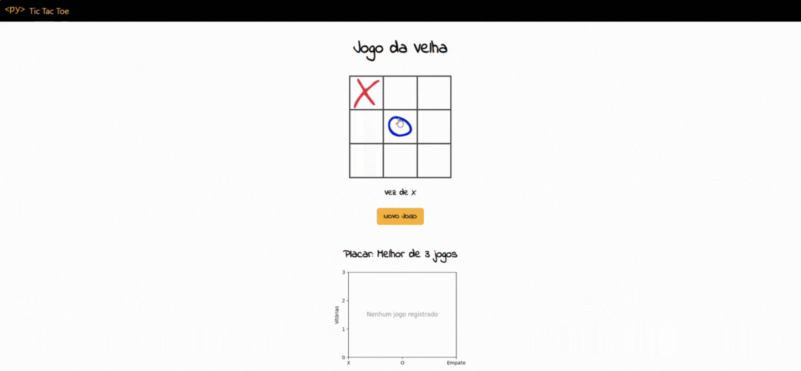

# Jogo da Velha com PyScript

> Este é um projeto simples de **Jogo da Velha (Tic Tac Toe)** feito com **HTML + CSS + PyScript**, permitindo que o jogo seja executado inteiramente no navegador, usando **Python como linguagem principal**.




## Funcionalidades

- ✅ Interface interativa 3x3 para o jogo
- 🔁 Botão de novo jogo
- 📊 Placar dinâmico com vitórias de X, O e empates
- 📈 Geração de gráfico de desempenho usando `matplotlib` (via PyScript)
- 🧠 Lógica do jogo 100% escrita em Python


## Como Executar Localmente

1. Certifique-se de que você possui o **Python instalado** (versão 3.x).
2. Clone ou baixe este repositório em sua máquina.
3. No terminal, vá até a pasta do projeto e execute:

```bash
python -m http.server 8000
```

4. Abra o navegador e acesse:
[http://localhost:8000](http://localhost:8000)


## Licença

Este projeto está licenciado sob a Licença MIT. Consulte o arquivo LICENSE para mais informações.

Feito com ♥ por [Jezebel Guedes](https://www.linkedin.com/in/jezebel-guedes/) 👋 Entre em contato!